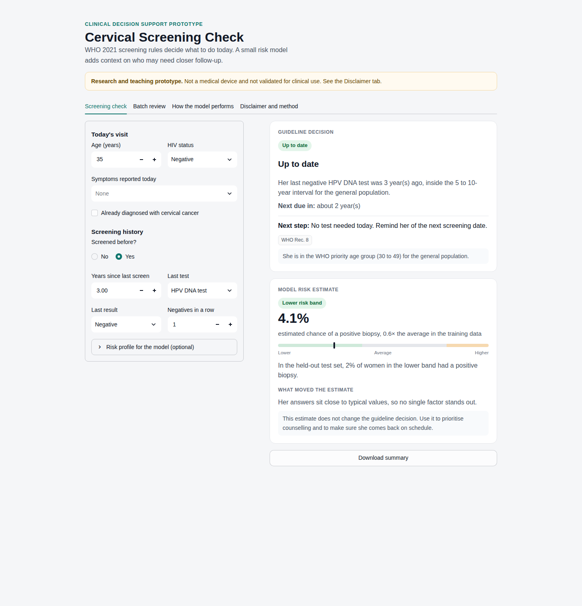
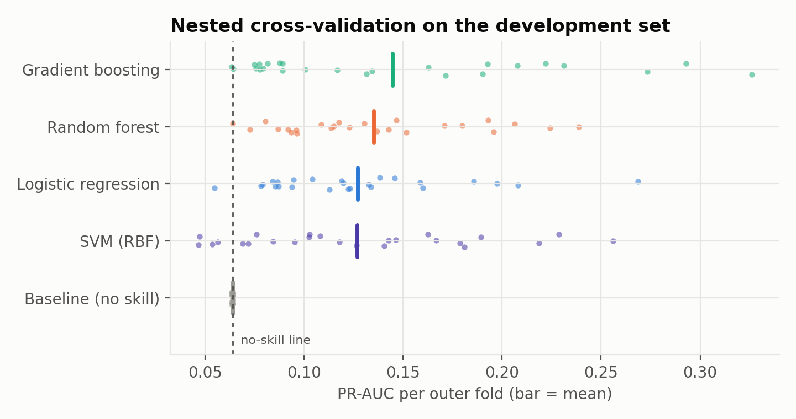
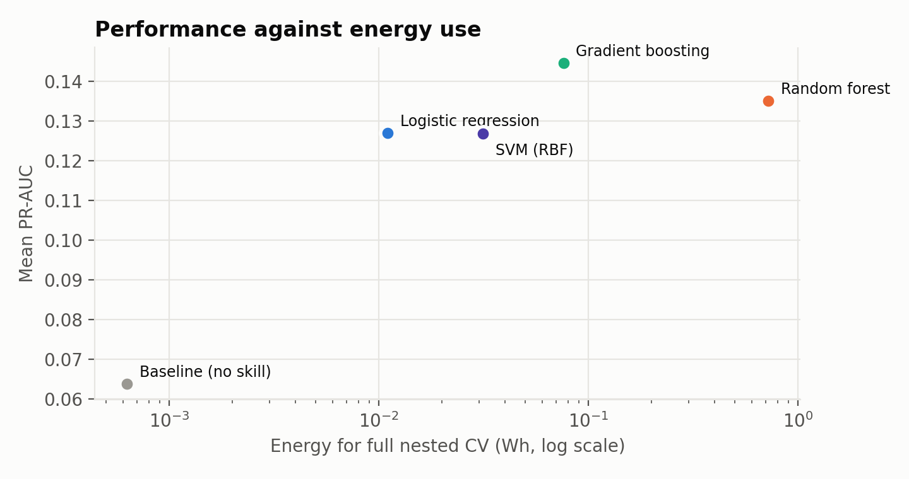

# Cervical Screening Check

A small clinical decision support tool for cervical cancer screening. It has two layers:

1. **Guideline rules.** Plain if/else logic that applies the WHO 2021 screening recommendations to a woman's age, HIV status, symptoms and screening history. This layer decides what should happen today: refer, screen now, come back later, or stop.
2. **A risk model.** A gradient boosting model that estimates the chance of a positive biopsy from questions a nurse can ask before any test is done. It adds context and never overrides the rules.

**Live app:** _add your Streamlit link here_
**Status:** research and teaching prototype. Not for clinical use (see [Disclaimer](#disclaimer)).



## Why I built it this way

I trained as a medical laboratory scientist in Ghana. In the labs where I worked, a correct result could still sit unread or arrive too late to change anything. So I cared less about squeezing out a high score and more about two questions: would a clinician trust the output, and would it still be honest when the data are messy?

That led to three decisions:

- **Rules first, model second.** Screening eligibility is already defined by guidelines. It should be written down where anyone can check it, not learned by a model. Every decision in the app shows which WHO recommendation produced it.
- **No leakage.** The dataset includes colposcopy (Hinselmann), Schiller and cytology results. Those come from the same work-up as the biopsy, so a model that uses them is partly reading the answer. I removed them, along with the prior-diagnosis columns. With those columns left in, the same kind of model reaches a test ROC-AUC of about 0.90. Without them it reaches 0.67. The lower number is the honest one.
- **Report what matters for screening.** With only about 6% positive cases, accuracy is meaningless (a model that says "negative" to everyone scores 94%). I used PR-AUC to compare models, chose the threshold for sensitivity, and report NPV, calibration and a decision curve.

## Results

Locked test set: 209 women, 14 positive biopsies. The test set was split off before any modelling and scored once.

| Metric | Value | 95% CI (bootstrap) |
|---|---|---|
| ROC-AUC | 0.67 | 0.51 to 0.80 |
| PR-AUC | 0.12 | no-skill level is 0.07 |
| Sensitivity at the chosen threshold | 86% (12 of 14) | 0.64 to 1.00 |
| Specificity | 34% | 0.28 to 0.41 |
| Negative predictive value | 97% | 0.93 to 1.00 |
| Brier score | 0.062 | |

The model is better at ranking than at separating. Women in its higher band had a positive biopsy rate about five times that of the lower band:

| Risk band | Women | Positive biopsies | Observed rate |
|---|---|---|---|
| Lower | 89 | 2 | 2.2% |
| Average | 64 | 5 | 7.8% |
| Higher | 56 | 7 | 12.5% |

The confidence intervals are wide because there are only 14 positive cases in the test set. I would not trust these numbers outside this dataset without external validation.

### Five models, compared on performance and energy use

Compared with nested cross-validation on the development set (5 folds × 5 repeats outside, 3-fold grid search inside). Energy was measured with [CodeCarbon](https://codecarbon.io/) using Ghana's grid carbon intensity.

| Model | Mean PR-AUC | Mean ROC-AUC | Energy for nested CV | Scoring 1,000 women | Size |
|---|---|---|---|---|---|
| Gradient boosting (chosen) | 0.145 | 0.60 | 0.08 Wh | 2 ms | 82 KB |
| Random forest | 0.135 | 0.60 | 0.72 Wh | 11 ms | 1 MB |
| Logistic regression | 0.127 | 0.58 | 0.01 Wh | 0.5 ms | 3 KB |
| SVM (RBF) | 0.127 | 0.51 | 0.03 Wh | 26 ms | 123 KB |
| Baseline (no skill) | 0.064 | 0.50 | <0.001 Wh | 0.2 ms | 2 KB |

The random forest used about ten times the energy of gradient boosting and more than sixty times that of logistic regression, and it was not better. I set the selection rule before looking at results: highest mean PR-AUC, and if two models are within 0.01, the one that uses less energy wins. On a cloud machine without hardware power counters CodeCarbon estimates CPU power, so the comparison between models is more reliable than the absolute numbers. Exact figures move slightly between runs; `reports/metrics/model_comparison.csv` has the values from the last run.




The whole analysis, from raw data to the leakage comparison, is walked through with outputs in [`notebooks/cervical_screening_analysis.ipynb`](notebooks/cervical_screening_analysis.ipynb). It also opens in Google Colab.

More figures are in `reports/figures`: ROC and precision-recall curves, calibration, decision curve and permutation importance.

## What the app does

- **Screening check.** Enter one woman's details and see the guideline decision, the reason, the next step and the WHO recommendation numbers, followed by the model's risk band and the factors that moved it. Updates as you type. You can download a plain-text summary.
- **Batch review.** Upload a CSV of a clinic list and get a decision and a risk band for each row. A blank template and a synthetic example file are included.
- **How the model performs.** The metrics, figures and energy comparison above, inside the app.
- **Disclaimer and method.** What the app is and is not.

The layout adapts to phone, tablet and desktop widths. Screenshots are in `docs/screenshots`.

## Guideline rules implemented

From the WHO guideline for screening and treatment of cervical pre-cancer lesions (2nd edition, 2021):

| Situation | Rule | WHO rec. |
|---|---|---|
| Symptoms (post-coital, intermenstrual or post-menopausal bleeding, etc.) | Refer for diagnostic work-up, whatever the screening history | safety rule I added |
| Start age | 30 for the general population, 25 for women living with HIV | 5, 25 |
| Interval after a negative HPV DNA test | 5 to 10 years general, 3 to 5 years with HIV | 8, 28 |
| Interval after negative VIA or cytology | 3 years | 9, 29 |
| HPV positive, triage negative | Retest at 24 months general, 12 months with HIV | 11, 31 |
| After treatment for CIN2/3 | HPV retest at 12 months | 13, 33 |
| Over 50 with two consecutive negatives on schedule | Screening can stop | 6, 26 |
| Preferred primary test | HPV DNA | 1 |

HIV status unknown uses the general schedule and flags that an HIV test would change it. The rules are covered by 25 unit tests in `tests/test_rules.py`.

## Project structure

```
cervical-screening-cdss/
├── app/
│   ├── streamlit_app.py        # the app
│   └── ui.py                   # styling and HTML components
├── src/cervical_cdss/
│   ├── rules.py                # WHO 2021 guideline logic
│   ├── features.py             # feature list, leakage rules, data loading
│   ├── model.py                # loading the model, risk bands, explanations
│   └── batch.py                # shared input handling for single and batch mode
├── notebooks/
│   └── cervical_screening_analysis.ipynb   # the full analysis, step by step, with outputs
├── scripts/
│   └── train_evaluate.py       # split, compare, measure energy, calibrate, test once
├── data/
│   ├── raw/                    # original UCI file, unchanged
│   ├── processed/              # dev.csv and test.csv written by the script
│   ├── sample/                 # batch template and synthetic example
│   └── DATA_CARD.md
├── models/
│   ├── cervical_risk_model.joblib
│   └── model_metadata.json     # threshold, band cut points, metrics, versions
├── reports/
│   ├── figures/
│   ├── metrics/                # fold scores, comparison, subgroup check, test metrics
│   └── MODEL_CARD.md
├── tests/                      # rules, leakage guards and model checks
├── docs/
├── .streamlit/config.toml
├── requirements.txt            # what the deployed app needs
└── requirements-dev.txt        # plus training and testing
```

## Run it yourself

```bash
git clone https://github.com/onipayedejohn/cervical-cancer-screening-cdss.git
cd cervical-screening-cdss
python -m venv .venv && source .venv/bin/activate      # Windows: .venv\Scripts\activate
pip install -r requirements-dev.txt

pytest                                   # 34 tests
jupyter notebook notebooks/cervical_screening_analysis.ipynb   # the walkthrough
python scripts/train_evaluate.py         # retrains everything, about 5 minutes on a laptop
streamlit run app/streamlit_app.py
```

The trained model is already in `models/`, so the app runs without retraining.

**Deploying on Streamlit Community Cloud:** push the repo to GitHub, create a new app, and set the main file path to `app/streamlit_app.py`. Keep the versions in `requirements.txt` as they are, because the saved model must be loaded with the same scikit-learn version it was trained with.

## How leakage was prevented

- Exact duplicate rows (23) removed **before** splitting, so no woman appears in both sets.
- Test set (25%, stratified) split off first and scored once at the end.
- Imputation and scaling live inside the scikit-learn pipeline, so they are fitted on training folds only.
- Hyperparameters tuned in an inner loop, performance estimated in an outer loop (nested CV).
- Threshold and risk-band cut points chosen from out-of-fold predictions on the development set, not from the test set.
- `assert_no_leakage()` blocks the excluded columns at training and at prediction time, and a test checks that dev and test share no rows.

## Limitations

- **Small and single-site.** 835 women from one hospital in Caracas, Venezuela, 54 positive biopsies. Nothing here has been validated on a Ghanaian or any African population.
- **Mostly young women.** Most women in the data are under 30, below the WHO start age for the general population, and very few are over 50. Estimates for older women are especially uncertain (see `reports/metrics/subgroup_age_dev_oof.csv`).
- **No HPV result.** The strongest predictor in real screening, an HPV test, is not in the data. That is the main reason the model is modest.
- **Biopsy as the label.** It is not clear that every woman in the dataset had a biopsy. Some negatives may be women who were never biopsied.
- **Rules are my reading of the guideline.** National programmes may differ. Ghana's programme should be checked before any real use.

## Disclaimer

This is a research and teaching prototype. It is not a medical device, has not been reviewed by any regulator, and has not been tested in a clinic. Do not use it to make decisions about real patients. Do not enter names or identifying details.

## Data and licence

Data: Fernandes, K., Cardoso, J., & Fernandes, J. (2017). *Cervical Cancer (Risk Factors)* [Dataset]. UCI Machine Learning Repository. https://doi.org/10.24432/C5Z310. Licensed CC BY 4.0.

Guideline: World Health Organization (2021). *WHO guideline for screening and treatment of cervical pre-cancer lesions for cervical cancer prevention*, 2nd ed. https://www.ncbi.nlm.nih.gov/books/NBK572318/

Code: MIT licence.

Onipayede John Kwaku · [GitHub](https://github.com/onipayedejohn)
